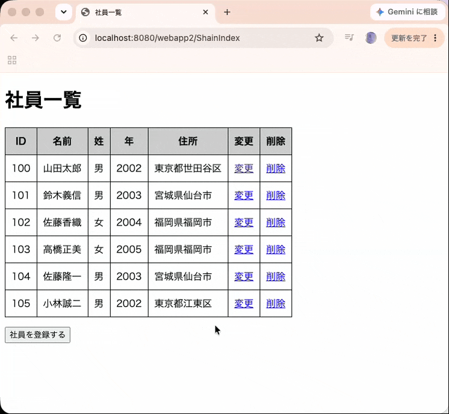

# 押印申請ワークフローシステム (gas_OINAPP)

Google Apps Script (GAS) と HTML/CSS/JavaScript で構築した、Webベースの社内押印申請・承認ワークフローアプリケーションです。
紙文書やハンコによる申請手続きのデジタル化・ペーパーレス化を実現し、承認プロセスのリアルタイム可視化および業務効率化を図るために開発しました。

---
・デモ画像（GIF）


## 📌 開発背景と課題解決

### 従来（As-Is）の課題
* **紙ベース運用によるタイムラグ**: 物理的な押印依頼や書類回覧に時間がかかり、承認進捗が不透明。
* **手入力バグと確認工数**: 必須項目漏れや社員番号のフォーマットミスによる再提出・差し戻しの発生。
* **履歴管理の煩雑さ**: 過去の承認経緯や差戻し理由が後から追跡しにくい。

### 解決策（To-Be）
* **完全Web化と即時通知**: ブラウザ上で申請から承認・差戻しまで完結。
* **データ駆動型バリデーション**: リアルタイム入力チェックによる入力不備の未然防止。
* **処理履歴（タイムライン）の可視化**: 申請・承認・差戻しの全履歴を追跡可能（JSON記録）。

---

## 🚀 主要機能

* **自動採番 ＆ 状態遷移制御**
  * 重複のない申請番号（`refNum`）の自動発番。
  * URLパラメータによる申請内容の特定および画面表示（一覧・詳細・承認画面）の動的ルーティング。
* **承認・差戻しワークフロー ＆ コメント必須化**
  * 申請内容を確認しながらの承認機能／コメント入力必須の差戻し機能。
* **処理履歴（タイムライン）表示**
  * 過去の操作ログ（誰が・いつ・何の操作を行ったか）をタイムライン形式で動的描画。
* **リアルタイム単一項目 ＆ 一括フォーム検証（データ駆動設計）**
  * フォーカスが外れた時（`onblur`）と送信時（`submit`）の検証ルールを配列で一元管理し、処理間でのエラー判定のズレ（不整合）を回避。
* **二重送信防止 ＆ スピナーローディングUI**
  * 非同期処理実行時のボタン非活性（`disabled`）処理により、連打・重複登録を防止。

---

## 🛠 システム構成・使用技術

| 区分 | 技術・サービス | 用途・選定理由 |
| :--- | :--- | :--- |
| **フロントエンド** | HTML5 / CSS3 / JavaScript | 標準的なWebコンポーネントによるレスポンシブ画面設計 |
| **バックエンド** | Google Apps Script (GAS) | インフラ構築不要。GWSアカウント認証との連携容易性 |
| **データベース** | Google スプレッドシート | ミドルウェア(DBMS)構築不要。リアルタイム共有・管理者のメンテ容易性 |
| **通知モジュール** | Gmail API | 承認者・申請者への即時自動メール配信 |


### 選定理由
GASを採用した最大の特徴は開発・稼働のスピード感です。サーバー契約なしで迅速に（且つ無料）デプロイ可能です。データソースに関しては、大量アクセスによるデータベース書き込みが発生しない社内業務においては、スプレッドシート（無料）をデータソースとすることで管理者のメンテ工数も削減できます。
勤務先のグループウェアが Google Workspace であったため既存環境（ログインレスでユーザ取得が可）を最大活用する思想でしたが、外部メールアドレスであっても正常に動作する設計としています。

---

```mermaid
graph TD
    Client[Webブラウザ<br>HTML / CSS / JS] -->|リクエスト / URLパラメータ| GAS[Google Apps Script<br>（バックエンド処理）]
    GAS -->|データ読み出し・追記| Sheet[("Google スプレッドシート<br>（データベース）")]
    GAS -->|承認・差戻し通知| Gmail["自動メール配信（Gmail API／.sendEmail()）"]


### テーブル構成

| 物理名 | 論理名 | 型（桁数）| 備考 |
| :--- | :--- | :--- | :-- |
| refNum | 起案番号| String | PK |
| applicationDate | 申請日| date |  |
| companyName | 起案会社 | String | |
| deptName | 所属部署| String | |
| employeeId | 申請者ID| String | |
| employeeName | 申請者名| String | |
| deptType | 所属部署種別| String | |
| sealCompany | 押印が必要な会社| String | |
| clientCompany | 相手先会社名| String | |
| documentName | 書類名| String | |
| copies | 必要な部数| Integer | |
| sealType | 必要押印| String | |
| approvalNum | 稟決番号| String | |
| remarks | 備考| String | |
| approverEmail | 承認者メールアドレス| String | |


